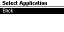

# App Loader Userspace Application

The App Loader userspace application works in tandem with the
[Process Manager](./process-manager.md) app and enables the user to install
applications during runtime interactively using the
[Dynamic App Loading](../setup/dynamic-app-loading.md) mechanism.

This section assumes that you have the correct kernel image
(`tutorials/nrf52840dk-dynamic-apps-and-policies`) installed on your device.

## Install the AppLoader Application

You can install the AppLoader app like any other Tock application. You can find
it in `libtock-c/examples/tutorials/dynamic-apps-and-policies/app_loader`.

```
$ cd libtock-c/examples/tutorials/dynamic-apps-and-policies/app_loader
$ make install
```

Once this application is installed, the user does not have to install other apps
using tockloader again!

## Exploring the AppLoader's Offerings

Once you have the app installed, you should be able to navigate to the
`Load New Applications` menu option. When you select it, you will be taken to a
new page titled `Select Application`, but for now there is nothing on that page.



Getting to this stage proves that our app is now functional. However, we still
want to be able to load new apps, so we need to make some changes.

## Adding Our First Test App

All we need to do is include the path to the application directory in our
`app_loader`'s makefile. To do this, open the `Makefile` located at
`libtock-c/examples/tutorials/dynamic-apps-and-policies/app_loader/Makefile` in
your favorite editor.

You don't need to know how makefiles work, or how to read one for the purpose of
this tutorial. We will only making one change to add new applications. Find this
block of code:

```
APPS_TO_EMBED := \
	# $(TOCK_USERLAND_BASE_DIR)/examples/blink \
```

And uncomment the blink line.

This tells the makefile that we want to be able to load blink during runtime and
not manually. Once this line is uncommented, we need to run `make` again. But
this time, we can directly run `make install` to build the image and flash it to
our device.

Once the new application is flashed on the device, navigate to Load New
Applications on the device again. You will now see `blink` as an available
option. When you select the `blink` option, you will be taken to a confirmation
screen asking if you really want to load the application. Select `Yes` and wait.
Once the application is installed and loaded, you will see a `Loading Success`
page on the screen, but even more exciting is that the onboard LEDs are now
blinking!

Go back to the main menu and select `Inspect Processes`. If you scroll down, you
can see `blink` is now on the list of active processes that you can interact
with just like in [Process Manager](./process-manager.md).

As an aside, check `loadable_binaries.h` in the `app_loader` directory. It
should be updated to include the details of the `blink` app. This is how we
embed external applications to `app_loader` and make them available for
installation during runtime.

## Installing Your Own Applications!

You can choose to follow a similar method to test out other applications
available in the `examples` folder or in `examples/tests`. Try installing the
`c_hello` app and verify that it works by passing it to the `app_loader` and
installing the app via the menu.

You are even encouraged to write your own applications, maybe make modifications
to existing examples in your own directory, or write a whole custom app for the
`nrf51840DK`.

```
APPS_TO_EMBED := \
	$(TOCK_USERLAND_BASE_DIR)/examples/blink \
    $(TOCK_USERLAND_BASE_DIR)/(your application's path)
```

Now, there is a high chance you will see something reminiscent of static from
old cable televisions. While not that exciting, this means the screen is not
fully utilized and there are apps for whom that screen real estate is reserved.

## Filling the Screen

If you look at the `dynamic-apps-and-policies` directory, you will notice there
are other application directories in addition to `app_loader` and
`process_manager`. First, let us install the `counter` app. Like with `blink` in
the previous section, we need to add the path where the `counter` app resides to
our `APPS_TO_EMBED` variable in the makefile.

```
APPS_TO_EMBED := \
	$(TOCK_USERLAND_BASE_DIR)/examples/blink \
    $(TOCK_USERLAND_BASE_DIR)/examples/tutorials/dynamic-apps-and-policies/counter \
```

Run `make install` once again. Once the device is flashed, navigate to the new
applications list and install `counter` like you did with `blink`. You should
see a counter that updates its count with a random interval between each update!

Now, to fill the remaining gap, we add the final application to the loadable
list. Add `temperature` to the makefile like you did with `counter` and install
the application. Once installed, you will see the bottom right corner of the
screen display the internal temperature of the chip!

> **Check this out**: Watch the count as the temperature app is installed. It
> keeps going up! The counter app does not use any nonvolatile storage. But,
> since dynamically loading apps does not reset the kernel (or any running apps)
> the counter keeps its count.

## Looking more closely at our apps...

Not everything is as it seems... if you watch the serial console, you will see
that one of the apps you just installed is doing more than what it claims to be
doing. The `temperature` app is sneakily logging your button presses! This is a
derivative of keylogging attacks.

At the core of it, we want our system to be secure and not leak information to
applications that is not meant for them. To restrict applications to only use
the resources they require for their functioning, we need to make kernel side
changes to add resource filtering.

Let us take a deeper look at this in the [Snooping](./snooping.md) part of the
tutorial, next.
