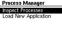

# Using the Process Manager Userspace Application

> insert image

The Process Manager application is an interactive, screen-based application for
viewing and controlling the applications installed on a Tock board. This guide
will help you install it and walk you through its features.

## Tock Kernel Image

If you haven't already, install the
`tutorials/nrf52840dk-dynamic-apps-and-policies` kernel on your board.

```
$ cd tock/boards/tutorials/nrf52840dk-dynamic-apps-and-policies
$ make install
```

## Install the Process Manager Application

You can install the Process Manager app like any other Tock application. You can
find it in
`libtock-c/examples/tutorials/dynamic-apps-and-policies/process_manager`.

```
$ cd libtock-c/examples/tutorials/dynamic-apps-and-policies/process_manager
$ make
$ tockloader install
```

## Exploring with the Process Manager Application

When the Tock kernel is running the Process Manager should be shown on the
screen:



Interact with the application using the buttons:

```
┌────────────────────────────────────────────────────────────────────┐
│                                                                    │
│                                                LED1 ☐ ☐ LED2       │
│                                                LED3 ☐ ☐ LED4       │
│           ┌────────────────┐                                       │
│           │                │                                        \
├───┐       │                │                                         │
│USB│       │     Screen     │                                         │
├───┘       │                │                      ┌─┐  ┌─┐           │
│           │                │                  Up--│O│  │O│           │
│           └────────────────┘                      └─┘  └─┘           │
│                                                   ┌─┐  ┌─┐           │
│                                             Down--│O│  │O│--Enter   /
│                                                   └─┘  └─┘         │
└────────────────────────────────────────────────────────────────────┘
```

| nRF52840dk Button Number | Action |
| ------------------------ | ------ |
| 1                        | Up     |
| 2                        | unused |
| 3                        | Down   |
| 4                        | Enter  |

Process Manager supports inspecting and controlling existing processes and
installing new applications.

### Viewing Active Processes

Scroll to "Inspect Processes" and hit enter (`BUTTON 4`). This will list all
active processes (including the Process Manager application). You can scroll up
and down to look through all installed applications.

### Details on a Specific Process

Scroll to a desired application such that it is highlighted on the screen. Press
the enter button (`BUTTON 4`) to select it. You will now see a list of details
about that application.

| Entry          | Name                     | Description                                                                                                                                                                            |
| -------------- | ------------------------ | -------------------------------------------------------------------------------------------------------------------------------------------------------------------------------------- |
| PID            | `ProcessId`              | The ProcessId is the runtime identifier for the process. Every time a process starts it gets a new ProcessId. All process IDs must be unique.                                          |
| ShortID        | `ShortId`                | The ShortId is the fixed identifier for a specific application. Each Tock kernel uses a policy for determining the ShortId. This identifier is persistent across reboots and restarts. |
| Timeslices Exp | Expired Timeslices       | The number of times the process exceeded its timeslice and was pre-empted by the kernel.                                                                                               |
| Syscall Count  | Number of System Calls   | How many system calls the process has made.                                                                                                                                            |
| Restart Count  | Number of Restarts       | How many times the process has been restarted, either manually or after a crash.                                                                                                       |
| State          | Process State            | The current state of the process. Most likely `Yielded` because the Process Manager must be running to update the screen.                                                              |
| State Control  | Change the Process State | Control the process by changing its state. See below.                                                                                                                                  |

### Controlling a Specific Process

The Process Manager application also enables you to control the execution of a
process. Highlight `State Control` and press enter. With the action field
highlighted, press enter to scroll through the available actions:

| Operation | Description                                                                   |
| --------- | ----------------------------------------------------------------------------- |
| Start     | Resume running a stopped process.                                             |
| Stop      | Halt a running process such that it is no longer scheduled to run.            |
| Fault     | Cause a process to crash and have the kernel run the process's fault handler. |
| Terminate | Stop a process and have its resources released.                               |
| Boot      | Start running a terminated or never started process.                          |

Choose the action for the selected process and then press down to highlight
`OK`, and then enter to perform that action.

> Not all actions are valid from all process states. In particular, boot is only
> valid when the process is terminated, and start and stop are only valid when
> the process is running or yielded.

Now that you have the Process Manager running, let's take advantage of the app
loading functionality in the [next section](./app-loader.md).
