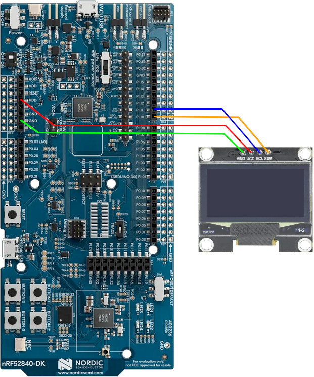
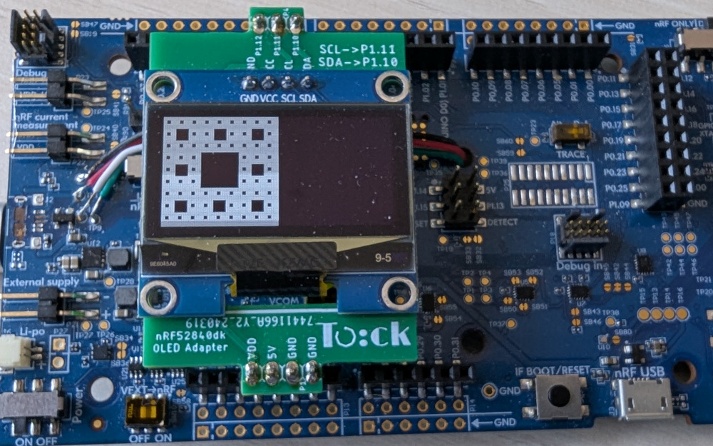

# Using a Screen with Tock

This guide describes how to configure the Tock kernel to support a screen (i.e.,
a graphical display). We will be exposing the screen as a resource to userspace
applications.

> **Note:** this guide is designed around using a SSD1306-based screen. However,
> other displays are supported in Tock and you can adapt these instructions to
> configure the screen hardware you are using.

## Configuring the Kernel

Kernel setup requires two main steps:

1. Instantiating a driver for the screen hardware you are using.
2. Instantiating a syscall capsule for providing a userpsace syscall interface.

### Setting Up the Screen Hardware Driver

Commonly, configuring the screen hardware driver means including a component in
the kernel's `main()` function.

For the SSD1306 on the nRF52840, that can be done with:

```rust
type I2cBus = nrf52840::i2c::TWI;

// Create virtual i2c bus for the screen. I2C address for the screen is 0x3c.
let ssd1306_i2c = components::i2c::I2CComponent::new(i2c_bus, 0x3c)
    .finalize(components::i2c_component_static!(I2cBus));

// Create the screen driver.
let ssd1306 = components::ssd1306::Ssd1306Component::new(ssd1306_i2c, true)
    .finalize(components::ssd1306_component_static!(I2cBus));

// Run the initialization commands for the screen.
ssd1306.init_screen();
```

If you are using a different MCU, you will have to set the correct type for the
I2C hardware.

Since the SSD1306 screen uses an I2C interface, we do need to setup an I2C bus.
That may already be done in the kernel you are using, but if not, here is an
example for the nRF52840:

```rust
const SCREEN_I2C_SDA_PIN: Pin = Pin::P1_10;
const SCREEN_I2C_SCL_PIN: Pin = Pin::P1_11;

// Create the I2C bus driver.
let i2c_bus = components::i2c::I2CMuxComponent::new(&nrf52840_peripherals.nrf52.twi1, None)
    .finalize(components::i2c_mux_component_static!(I2cBus));

// Configure the I2C bus to use the correct pins and clock rate.
nrf52840_peripherals.nrf52.twi1.configure(
    nrf52840::pinmux::Pinmux::new(SCREEN_I2C_SCL_PIN as u32),
    nrf52840::pinmux::Pinmux::new(SCREEN_I2C_SDA_PIN as u32),
);
nrf52840_peripherals
    .nrf52
    .twi1
    .set_speed(nrf52840::i2c::Speed::K400);
```

### Setting Up the Screen System Call Interface

With the hardware driver configured, we now want to expose the screen to
userspace via the system call interface. Tock supports two variants of the
screen system call interface:

1. A version (`screen.rs`) which gives all processes access to the entire
   screen.
2. A version (`screen_shared.rs`) which uses processes' `AppId`s to give
   specific applications access to specific regions of the screen.

You must choose which one you want to provide from your kernel.

#### Option 1: Simple Screen (All Processes Have Full Access)

Instantiate the screen syscall driver capsule using the component. You will pass
in the screen hardware driver from the previous step.

```rust
let screen = components::screen::ScreenComponent::new(
    board_kernel,
    capsules_extra::screen::DRIVER_NUM,
    ssd1306,
    None,
)
.finalize(components::screen_component_static!(1032));
```

We can configure the screen type the board uses:

```rust
// Screen
type ScreenDriver = components::screen::ScreenComponentType;
```

#### Option 2: Shared Screen (Processes Have Specific Screen Regions)

The shared screen component is very similar to the screen component, however, we
must also provide a mapping of applications to the regions of the screen they
have access to. To identify applications we use the `AppId` mechanism,
specifically apps' `ShortId`s. We use pixels to identify regions assigned to
each application.

Here is an example assigning three regions (the left side of the screen, the top
right, and the bottom right) to three separate applications. We must create the
`ShortId`s for each app, and how to do that is based on the AppId assignment
policy. The example here uses a CRC of the process name to create a fixed
`ShortId`. Different kernels might use different assignment policies and this
setup needs to match.

```rust
fn crc(s: &'static str) -> u32 {
    kernel::utilities::helpers::crc32_posix(s.as_bytes())
}

let app1_appid = kernel::process::ShortId::Fixed(core::num::NonZeroU32::new(crc("app1_name")).unwrap())
let app2_appid = kernel::process::ShortId::Fixed(core::num::NonZeroU32::new(crc("app2_name")).unwrap())
let app3_appid = kernel::process::ShortId::Fixed(core::num::NonZeroU32::new(crc("app3_name")).unwrap())

let apps_regions = static_init!(
    [capsules_extra::screen_shared::AppScreenRegion; 3],
    [
        capsules_extra::screen_shared::AppScreenRegion::new(
            app1_appid,
            0,     // x
            0,     // y
            8 * 8, // width
            8 * 8  // height
        ),
        capsules_extra::screen_shared::AppScreenRegion::new(
            app2_appid,
            8 * 8, // x
            0,     // y
            8 * 8, // width
            4 * 8  // height
        ),
        capsules_extra::screen_shared::AppScreenRegion::new(
            app3_appid,
            8 * 8, // x
            4 * 8, // y
            8 * 8, // width
            4 * 8  // height
        )
    ]
);
```

Once we have those mappings we can instantiate the `SharedScreen` with the
screen hardware driver and the permissions:

```rust
let screen = components::screen::ScreenSharedComponent::new(
    board_kernel,
    capsules_extra::screen::DRIVER_NUM,
    ssd1306,
    apps_regions,
)
.finalize(components::screen_shared_component_static!(1032, Screen));
```

```rust
// Screen
type ScreenDriver = components::screen::SharedScreenComponentType;
```

#### Exposing the System Call Driver to Userspace

With the appropriate syscall driver capsule setup, we now can add it to the
platform struct and expose the interface to userspace.

```rust
struct Platform {
    ...
    screen: &'static ScreenDriver,
    ...
}
```

then set it when instantiation the `Platform`:

```rust
let platform = Platform {
    ...
    screen,
    ...
};
```

then set up the driver number for the syscall:

```rust
impl SyscallDriverLookup for Platform {
    fn with_driver<F, R>(&self, driver_num: usize, f: F) -> R
    where
        F: FnOnce(Option<&dyn kernel::syscall::SyscallDriver>) -> R,
    {
        match driver_num {
            ...
            capsules_extra::screen::DRIVER_NUM => f(Some(self.screen)),
            ...
        }
    }
}
```

## Attaching a SSD1306 Screen to the nRF52840dk

For various Tock Tutorials we have created a SSD1306
[screen adapter](https://github.com/tock/tutorial-resources/blob/main/hw/nrf52840dk-screen/README.md)
for the nRF52840dk. This adapter simply maps pins and does not add any
additional circuits/components.


You can connect an SSD1306-based OLED to the nRF52840dk without that adapter
board by jumpering pins.



The pin mapping is:

| SSD1306 | nRF52840dk |
| ------- | ---------- |
| SCL     | P1.11      |
| SDA     | P1.10      |
| VCC     | VDD        |
| GND     | GND        |

There are many SSD1306 OLED screens available for purchase. Generally any of
them should work. The 128x64 pixel screens tend to come in two sizes: 0.96" and
1.3". **However**, in our experience the physically larger 1.3" screens are
often listed as using the SSD1306 chip, but _actually_ use the SH1106 chip.
These two are similar, but not exactly the same. It can be difficult to
determine exactly what you are buying. If you have a SSD1306 OLED screen and it
seems to be just showing static, you might actually have the SH1106. Tock has a
driver for that chip as well, and you can update your kernel to use the
`Sh1106Component` component instead.

## Using the Screen in an Application

You can run a simple screen test app by installing the
[Sierpiński carpet test](https://github.com/tock/libtock-c/tree/master/examples/tests/screen/sierpinski_carpet)
libtock-c app.



### U8G2 Library

Drawing on a screen with a raw pixel buffer is difficult. Tock supports a simple
graphics library called [U8G2](https://github.com/olikraus/u8g2) that makes
drawing graphics easier. You can try this by installing on the of the
[U8G2 demos](https://github.com/tock/libtock-c/tree/master/examples/tests/u8g2-demos),
such as the
[circle demo](https://github.com/tock/libtock-c/tree/master/examples/tests/u8g2-demos/circle).


