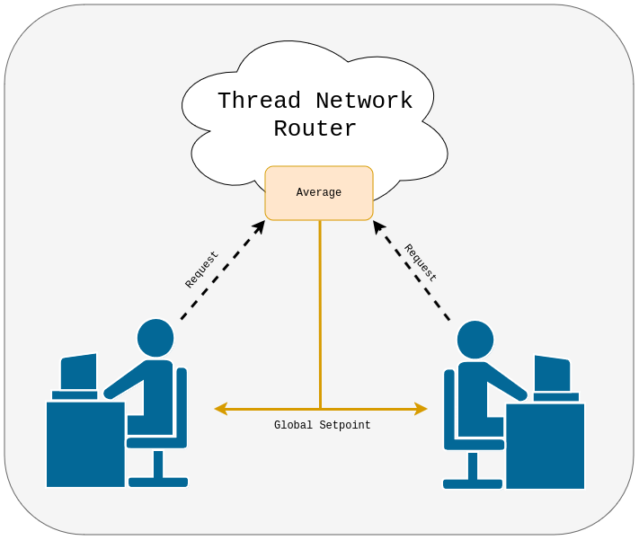

# OpenThread Temperature Sensor Network with Tock

This module and submodules will walk you through how to create a Tock
temperature sensor network mote that communicates over a Thread network.

**ADD IMAGE**

## Hardware Notes

This tutorial requires a Tock-supported board that has an IEEE
802.15.4-compatible radio and supports Thread. While any such board
should work, we recommend the nRF52840DK and assume this board is used
throughout this tutorial.

Compatible boards:
- All Tock-supported boards with an `nRF52840` chip, such as:
  - [Nordic Semiconductor nRF54840DK](https://github.com/tock/tock/tree/master/boards/nordic/nrf52840dk)
  - [Nordic Semiconductor nRF54840 Dongle](https://github.com/tock/tock/tree/master/boards/nordic/nrf52840_dongle)
  - [MakePython nRF52840](https://github.com/tock/tock/tree/master/boards/nordic/makepython-nrf52840)
  - [Adafruit CLUE - nRF52840 Express with Bluetooth LE](https://github.com/tock/tock/tree/master/boards/nordic/clue_nrf52840)
  - [Particle Boron](https://github.com/tock/tock/tree/master/boards/nordic/particle_boron)

## Project Setting

In this project we want to demonstrate how the Tock operating system can
function as a flexible and reliable platform to build integrated systems. In
particular, we demonstrate Tock's ability to run mutliple, mutually-distrustful
applications on a single microcontroller, and it's IEEE 802.15.4 / Thread
communications stack.

To demonstrate these features, we will build an HVAC control system for a shared
office environment. Each employee will have access to their own HVAC control
unit, connected to the central HVAC system through a Thread network. As the
temperature set point can be a contencious subject, we allow each employee to
enter their desired temperature. In turn, their control unit will display the
average temperature set across all controllers, in addition to the current
temperature at the control unit. We use Tock's OpenThread-based communications
stack and it's ability to run multiple concurrent applications to build this
control unit (*mote*).

We divide the mote's functionality into three separate applications:
- The *control application* is responsible for interacting with the user. It
  drives the connected screen to display the current temperature and the local
  and global-average set points.
- The *sensor application* gathers readings from the `nRF52840`s internal
  temperature sensor and exposes them to the control application.
- Last but not least, the *communication application* is responsible for
  exchanging data with other participants using the Thread network.

By decoupling the *sensor* and *communication* applications, the Tock kernel
ensures that the mote can remain responsive even in the case of failures in
either application. In this tutorial we demonstratate this by injecting a bug into
the communication application and deliberately faulting it with a malicious
packet.

## nRF52840dk Hardware Setup

Make sure the switches and jumpers are properly configured on your board:
1. The "Power" switch on the top left should be set to "On".
2. The "nRF power source" switch in the top middle of the board should be set to
   "VDD".
3. The "nRF ONLY | DEFAULT" switch on the bottom right should be set to
   "DEFAULT".

You should plug one USB cable into the top of the board for programming (NOT
into the "nRF USB" port on the side).

## Organization and Getting Oriented to Tock

Tock consists of multiple inter-working components. We briefly describe the
general structure of Tock and will deep-dive into these components throughout
the tutorial:

A Tock system contains primarily two components:

1. The Tock kernel, which runs as the operating system on the board. This is
   compiled from the [Tock repository](https://github.com/tock/tock).
2. Userspace applications, which run as processes and are compiled and loaded
   separately from the kernel.

The Tock kernel is compiled specifically for a particular hardware device,
termed a "board". Tock provides a set of reference board files under
[`/boards/<board name>`](https://github.com/tock/tock/tree/master/boards). Any
time you need to compile the kernel or edit the board file, you will go to that
folder. You also install the kernel on the hardware board from that directory.

While the Tock kernel is written entirely in Rust, it supports userspace
applications written in multiple languages. In particular, we provide two
userspace libraries for application development in C and Rust respectively:
- `libtock-c` for C applications (https://github.com/tock/libtock-c)
- `libtock-rs` for Rust applications (https://github.com/tock/libtock-rs)

We will use `libtock-c` in this tutorial. Its example-applications are located
in the [`/examples`](https://github.com/tock/libtock-c/tree/master/examples)
directory of the `libtock-c` repository.

## Stages

We divide this tutorial into four stages, with checkpoints that you can use to
skip ahead. Each stage contains information on how to obtain all checkpoint-code
required for it.

1. [*Sensor Application*](sensor-app.md): We start by creating a simple application
   that reads the `nRF52840DK` internal temperature sensor and prints the current
   temperature onto the console.

   This demonstrates how you can flash a Tock kernel and applications onto your
   development board, and introduces some key Tock concepts.

2. We continue by extending this application into an "IPC
   service". This will make the current temperature accessible to
   other applications that request it.

   Our *controller application* will use the information provided through this
   interface. We also create the scaffolding required for the controller app.

3. [Following this, we develop the *communication application*](comms-app.md). This
   application will let our mote join the Thread network and exchange messages.

4. [Finally, our *control application*](control-app.md) ties the prior two apps
   together. It builds a user interface that we display on the attached screen
   and will continue to work even if the communication app faults.

Sound good? Let's [get started](sensor-app.md).
