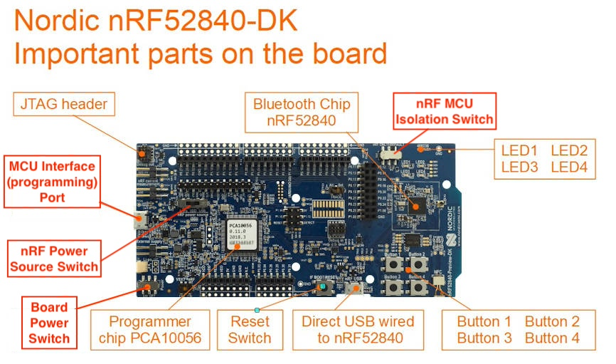

# OpenThread Temperature Sensor Network with Tock

This module and submodules will walk you through how to create a Tock
temperature sensor network mote that communicates over a Thread network.

## Hardware Notes

This tutorial requires a Tock-supported board that has an IEEE
802.15.4-compatible radio and supports Thread. While any such board should work,
we recommend the nRF52840DK and assume this board is used throughout this
tutorial.

Compatible boards:

- All Tock-supported boards with an `nRF52840` chip, such as:
  - [Nordic Semiconductor nRF54840DK](https://github.com/tock/tock/tree/master/boards/nordic/nrf52840dk)
  - [Nordic Semiconductor nRF54840 Dongle](https://github.com/tock/tock/tree/master/boards/nordic/nrf52840_dongle)
  - [MakePython nRF52840](https://github.com/tock/tock/tree/master/boards/nordic/makepython-nrf52840)
  - [Adafruit CLUE - nRF52840 Express with Bluetooth LE](https://github.com/tock/tock/tree/master/boards/nordic/clue_nrf52840)
  - [Particle Boron](https://github.com/tock/tock/tree/master/boards/nordic/particle_boron)

## Project Setting

In this project we want to demonstrate how the Tock operating system can
function as a flexible and reliable platform to build integrated systems. In
particular, we demonstrate Tock's ability to run mutliple, mutually-distrustful
applications on a single microcontroller, and it's IEEE 802.15.4 / Thread
communications stack.

To demonstrate these features, we will build an HVAC control system for a shared
office environment. Each employee will have access to their own HVAC control
unit, connected to the central HVAC system through a Thread network. As the
temperature set point can be a contencious subject, we allow each employee to
enter their desired temperature. In turn, their control unit will display the
average temperature set across all controllers, in addition to the current
temperature at the control unit. We use Tock's OpenThread-based communications
stack and its ability to run multiple concurrent applications to build this
control unit (_mote_).

We divide the mote's functionality into three separate applications:

- The _screen app_ drives the connected screen to display the current
  temperature and the local and global-average set points.
- The _sensor app_ gathers readings from the `nRF52840`'s internal
  temperature sensor and exposes them to the control application.
- Last but not least, the _communication app_ is responsible for
  exchanging data with other participants using the Thread network.

By decoupling the _sensor_ and _communication_ applications, the Tock kernel
ensures that the mote can remain responsive even in the case of failures in
either application. In this tutorial we demonstratate this by injecting a bug
into the communication application and deliberately faulting it with a malicious
packet.

## Software Prerequisites

- Getting Started Guide
- Rust
- Make
- GCC for ARM and RISC-V
- Tockloader Python Package

## nRF52840dk Hardware Setup

Make sure the switches and jumpers are properly configured on your board:

1. The board "Power" switch on the bottom left should be set to "On".
2. The "nRF power source" switch in the top middle of the board should be set to
   "VDD".
   - _Note:_ If you have a screen already attached, this switch is partially
             hidden underneath the screen.
3. The isolation switch, labeled "nRF ONLY | DEFAULT", on the top right should
   be set to "DEFAULT".

You should plug one USB cable into the side of the board for programming (NOT
into the "nRF USB" port on the bottom right).

If you have a SSD1306-based screen with I2C pins, you should attach it to pins
P1.10 (SDA) and P1.11 (SCL).

See this diagram for the full configuration:

<pre style="transform: rotate(270deg); font-size: small; margin-top: calc(1vw - 40%);">
     ┌────────────────┬───┬─────────────────┐
     │┌POWER┐         │USB│← PROG/DEBUG     │
     ││ ON ▓│         └───┘                 │
     ││OFF ░│                               │
     │└─────┘          ┌──DEBUG──┐          │
     │                 │VDD nRF ▪│  P0.27 □ │
     │                 │VDD nRF ▪│  P0.26 □ │
     │ □ VDD   ┌SOURCE┐│SWD SEL ▪│  P0.02 □ │
     │ □ VDD   │LiPo ░││ SWD IO ▪│    GND □ │
     │ □ RESET │ VDD ▓││SWD CLK ▪│  P1.15 □ │
VCC →│ ▣ VDD   │ USB ░││    SWO ▪│  P1.14 □ │
     │ □ 5V    └──────┘│  RESET ▪│  P1.13 □ │
     │ □ GND           │        ▪│  P1.12 □ │
GND →│ ▣ GND     ┌────┐│    VIN ▪│  P1.11 ▣ │← I2C SCL
     │ □ NC      │JTAG││  VDDHV ▪│  P1.10 ▣ │← I2C SDA
     │         ┐ │    ││  VDDHV ▪│          │
     │ □ P0.03 │ └────┘│ VIOREF ▪│  P1.08 □ │
     │ □ P0.04 A       │        ▪│  P1.07 □ │
     │ □ P0.28 D       └─────────┘  P1.06 □ │
     │ □ P0.29 C                    P1.05 □ │
     │ □ P0.30 │                    P1.04 □ │
     │ □ P0.31 │                    P1.03 □ │
     │         ┘                    P1.02 □ │
     │                              P1.01 □ │
     │                                      │
     │                              P0.10 □ │
     │                              P0.09 □ │
     │                              P0.08 □ │
     │ ☉ RESET                      P0.07 □ │
     │   BTN                        P0.06 □ │
     ├───┐                          P0.05 □ │
     │USB│  nRF                     P0.01 □ │
     │   │← PERIPHERAL              P0.00 □ │
     ├───┘                           ┌─────┐│
     │                               │░ nRF││
     │BTN3 BTN1                      │▓ DEF││
     │ ☉    ☉                        └─────┘│
     │BTN4 BTN2                  LED3 LED1  │
     │ ☉    ☉                     □    □    │
     │                ┌───┐      LED4 LED2  │
     │ ┌─┐            │nRF│       □    □    │
     │ │ │NFC         └───┘                 │
     │ └─┘                                  │
     └───                    ───────────────┘
         ╲                  ╱
          ──────────────────
</pre>

## Organization and Getting Oriented to Tock

Tock consists of multiple inter-working components. We briefly describe the
general structure of Tock and will deep-dive into these components throughout
the tutorial:

A Tock system contains primarily two components:

1. The Tock kernel, which runs as the operating system on the board. This is
   compiled from the [Tock repository](https://github.com/tock/tock).
2. Userspace applications, which run as processes and are compiled and loaded
   separately from the kernel.

The Tock kernel is compiled specifically for a particular hardware device,
termed a "board". Tock provides a set of reference board files under
[`/boards/<board name>`](https://github.com/tock/tock/tree/master/boards). Any
time you need to compile the kernel or edit the board file, you will go to that
folder. You also install the kernel on the hardware board from that directory.

While the Tock kernel is written entirely in Rust, it supports userspace
applications written in multiple languages. In particular, we provide two
userspace libraries for application development in C and Rust respectively:

- `libtock-c` for C applications ( [tock/libtock-c](https://github.com/tock/libtock-c) )
- `libtock-rs` for Rust applications ( [tock/libtock-rs](https://github.com/tock/libtock-rs) )

We will use `libtock-c` in this tutorial. Its example applications are located
in the [`/examples`](https://github.com/tock/libtock-c/tree/master/examples)
directory of the `libtock-c` repository.

## Thread Router

For this tutorial, we assume that one nRF52840DK is dedicated to be a Thread
router board. As a participant in a hosted tutorial, you will likely not need to
set this up yourself. However, we do
[provide a pre-built image and some instructions](./router-setup.md) for how to
set up this router as well.

## Stages

We divide this tutorial into five stages, with checkpoints that you can use to
skip ahead. Each stage contains information on how to obtain all checkpoint-code
required for it.

1. [_Sensor Application_](sensor-app.md): We start by creating a simple
   application that reads the `nRF52840DK` internal temperature sensor and
   prints the current temperature onto the console.

   This demonstrates how you can flash a Tock kernel and applications onto your
   development board, and introduces some key Tock concepts.

2. [Following this, we develop the _communication application_](comms-app.md).
   This application will let our mote join the Thread network.

3. We continue by adding the [_screen application_](screen-app.md). This app
   will:

   - Receive user input to set the desired temperature.
   - Display the measured temperature, desired temperature setpoint, and global
     setpoint to the attached OLED screen.

4. Taking these three applications, we [then add IPC functionality](ipc.md) to
   allow for passing data between applications.

5. Finally,
   [we demonstrate how Tock's mutually distrustful application model can protect the system](robustness.md)
   from misbehavior in any given app.

Sound good? Let's [get started](sensor-app.md).
