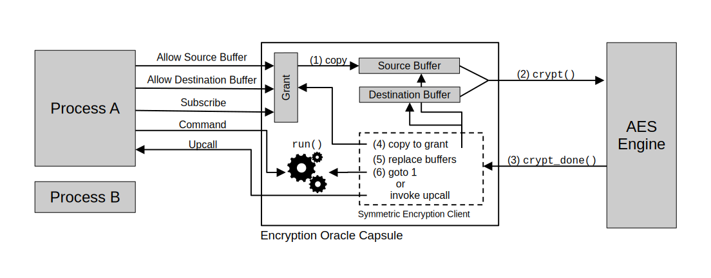

# Encryption Oracle Capsule

Our HOTP security key works by storing a number of secrets on the device, and
using these secrets together with some _moving factor_ (e.g., a counter value or
the current time) in an HMAC operation. To be useful, our device needs some way
to store these secrets, for instance in its internal flash.

However, storing such secrets in plaintext as we did in the previous submodule
is not particularly secure. For instance, many microcontrollers offer debug
ports which can be used to gain read and write access to flash. Even if these
ports can be locked down,
[such protection mechanisms have been broken in the past](https://blog.includesecurity.com/2015/11/firmware-dumping-technique-for-an-arm-cortex-m0-soc/).
Apart from that, disallowing external flash access makes debugging and updating
our device much more difficult.

To circumvent these issues, we will build an _encryption oracle capsule_: this
Tock kernel module will allow applications to request decryption of some
ciphertext, using a kernel-internal key not exposed to applications themselves.
By only storing an encrypted version of their secrets, applications are free to
use unprotected flash storage, or store them even external to the device itself.
This is a commonly used paradigm in _root of trust_ systems such as TPMs or
[OpenTitan](https://opentitan.org/), which feature hardware-embedded keys that
are unique to a chip and hardened against key-readout attacks.

Our kernel module will use a hard-coded symmetric encryption key (AES-128
CTR-mode), embedded in the kernel binary. While this does not actually
meaningfully increase the security of our example application, it demonstrates
some important concepts in Tock:

- How custom userspace drivers are implemented, and the different types of
  system calls supported.
- How Tock implements asynchronous APIs in the kernel.
- Tock's hardware-interface layers (HILs), which provide abstract interfaces for
  hardware or software implementations of algorithms, devices and protocols.

## Background

### Capsules – Tock's Kernel Modules

Most of Tock's functionality is implemented in the form of capsules – Tock's
equivalent to kernel modules. Capsules are Rust modules contained in Rust crates
under the `capsules/` directory within the Tock kernel repository. They can be
used to implement userspace drivers, hardware drivers (for example, a driver for
an I²C-connected sensor), or generic reusable code snippets.

What makes capsules special is that they are _semi-trusted_: they are not
allowed to contain any `unsafe` Rust code, and thus can never violate Tock's
memory safety guarantees. They are only trusted with respect to _liveness_ and
_correctness_ – meaning that they must not block the kernel execution for long
periods of time, and should behave correctly according to their specifications
and API contracts.

### Capsule Directory in the Tock Repository

While a single "capsule" is generally self-contained in a Rust _module_ (`.rs`
file), these modules are again grouped into Rust crates such as `capsules/core`
and `capsules/extra`, depending on certain policies. For instance, capsules in
`core` have stricter requirements regarding their code quality and API
stability. Neither `core` nor the `extra` `extra` capsules crates allow for
external dependencies (outside of the Tock repository).
[The document on external dependencies](https://github.com/tock/tock/blob/master/doc/ExternalDependencies.md)
further explains these policies.

## Developing the Encryption Oracle

We start our encryption oracle driver by creating a new capsule called
`encryption_oracle`. Create a file under
`capsules/extra/src/tutorials/encryption_oracle.rs` in the Tock kernel
repository with the following contents:

```rust
// Licensed under the Apache License, Version 2.0 or the MIT License.
// SPDX-License-Identifier: Apache-2.0 OR MIT
// Copyright Tock Contributors 2024.

pub static KEY: &'static [u8; kernel::hil::symmetric_encryption::AES128_KEY_SIZE] =
    b"InsecureAESKey12";

pub struct EncryptionOracleDriver {}

impl EncryptionOracleDriver {
    /// Create a new instance of our encryption oracle userspace driver:
    pub fn new() -> Self {
        EncryptionOracleDriver {}
    }
}

```

This is the basic skeleton for a Tock capsule.

To make this capsule accessible to other Rust modules and crates, add it to
`capsules/extra/src/tutorials/mod.rs`:

```diff
  #[allow(dead_code)]
  pub mod encryption_oracle_chkpt5;

+ pub mod encryption_oracle;
```

> **EXERCISE:** Make sure your new capsule compiles by running `cargo check` in
> the `capsules/extra/` folder.

The `capsules/tutorial` crate already contains checkpoints of the encryption
oracle capsule we'll be writing here. Feel free to use them if you're stuck. We
indicate that your capsule should have reached an equivalent state to one of our
checkpoints through blocks such as the following:

> **CHECKPOINT:** `encryption_oracle_chkpt0.rs`

### Userspace Drivers

Now that we have a basic capsule skeleton, we can think about how this code is
going to interact with userspace applications. Not every capsule needs to offer
a userspace API, but those that do must implement
[the `SyscallDriver` trait](https://docs.tockos.org/kernel/syscall/trait.syscalldriver).

Tock supports different types of application-issued systems calls, four of which
are relevant to userspace drivers:

- _subscribe_: Allows an application to register _upcalls_, which are functions
  being invoked in response to certain events.

- _read-only allow_: Allows an application to share a buffer with a kernel
  module. The kernel only has read access to the buffer.

- _read-write allow_: Same as the read-only allow, but kernel modules can also
  mutate the application-provided buffer.

- _command_: Allows applications to signal arbitrary events or send requests to
  the kernel module.

All Tock system calls are synchronous, which means that they should immediately
return to the application. Capsules must not implement long-running operations
by blocking on a command system call.

More information can be found in the
[syscalls documentation](https://github.com/tock/tock/blob/master/doc/Syscalls.md#overview-of-system-calls-in-tock).

### Application Grants

Now there's just one key part missing to understanding Tock's system calls: how
kernel modules store application-specific data. To avoid using a standard heap,
which could be exhausted and leave the kernel in an unrecoverable state, Tock
uses _grants_. Grants are essentially regions of the application's allocated
memory space that the kernel uses to store state on behalf of the process. This
is distinct from an allow as the application never has access to grant data.
More information can be found in the
[grants documentation](https://github.com/tock/tock/blob/master/doc/Design.md#grants).

Our encryption oracle driver will need to keep track of some per-process state.
Thus we extend the above driver with a Rust struct to be stored within a grant,
called `ProcessState`. For now, we just keep track of whether a process has
requested a decryption operation. Add the following code snippet to your
capsule:

```rust
#[derive(Default)]
pub struct ProcessState {
    request_pending: bool,
}
```

By implementing `Default`, grant types can be allocated and initialized on
demand. We integrate this type into our `EncryptionOracleDriver` by adding a
special `process_grants` variable of
[type `Grant`](https://docs.tockos.org/kernel/grant/struct.grant). This `Grant`
struct takes a generic type parameter `T` (which we set to our `ProcessState`
struct above) next to some constants: as a driver's subscribe upcall and allow
buffer slots also consume some memory, we store them in the process-specific
grant as well. Thus, `UpcallCount`, `AllowRoCont`, and `AllowRwCount` indicate
how many of these slots should be allocated respectively. For now we don't use
any of these slots, so we set their counts to zero. Add the `process_grants`
variable to your `EncryptionOracleDriver`:

```rust
use kernel::grant::{Grant, UpcallCount, AllowRoCount, AllowRwCount};

pub struct EncryptionOracleDriver {
    process_grants: Grant<
        ProcessState,
        UpcallCount<0>,
        AllowRoCount<0>,
        AllowRwCount<0>,
    >,
}
```

> **EXERCISE:** The `Grant` struct will be provided as an argument to
> constructor of the `EncryptionOracleDriver`. Extend `new` to accept it as an
> argument. Afterwards, make sure your code compiles by running `cargo check` in
> the `capsules/extra/` directory.

### Implementing a System Call

Next we can start to implement a proper system call. We start with the basics
and implement a simple _command_-type system call: upon request by the
application, the Tock kernel will call a method in our capsule.

For this, we implement the following `SyscallDriver` trait for our
`EncryptionOracleDriver` struct. This trait contains two important methods:

- [`command`](https://docs.tockos.org/kernel/syscall/trait.syscalldriver#method.command):
  this method is called whenever an application issues a _command_-type system
  call towards this driver, and
- [`allocate_grant`](https://docs.tockos.org/kernel/syscall/trait.syscalldriver#tymethod.allocate_grant):
  this is a method required by Tock to allocate some space in the process'
  memory region. The implementation of this method always looks the same, and
  while it must be implemented by every userspace driver, it's exact purpose is
  not important right now.

```rust
use kernel::{ErrorCode, ProcessId};
use kernel::syscall::{SyscallDriver, CommandReturn};

impl SyscallDriver for EncryptionOracleDriver {
    fn command(
        &self,
        command_num: usize,
        _data1: usize,
        _data2: usize,
        processid: ProcessId,
    ) -> CommandReturn {
        // Syscall handling code here!
        unimplemented!()
    }

    // Required by Tock for grant memory allocation.
    fn allocate_grant(&self, processid: ProcessId) -> Result<(), kernel::process::Error> {
        self.process_grants.enter(processid, |_, _| {})
    }
}
```

The function signature of `command` tells us a lot about what we can do with
this type of system call:

- Applications can provide a `command_num`, which indicates what type of
  _command_ they are requesting to be handled by a driver, and
- they can optionally pass up to two `usize` data arguments.
- The kernel further provides us with a unique identifier of the calling
  process, through a type called `ProcessId`.

Our driver can respond to this system call using a `CommandReturn` struct. This
struct allows for returning either a _success_ or a _failure_ indication, along
with some data (at most four `usize` return values). For more details, you can
look at its definition and API
[here](https://docs.tockos.org/kernel/syscall/struct.commandreturn).

In our encryption oracle driver we only need to handle a single application
request: to decrypt some ciphertext into its corresponding plaintext. As we are
missing the actual cryptographic operations still, let's simply store that a
process has made such a request. Because this is per-process state, we store it
in the `request_pending` field of the process' grant region. To obtain a
reference to this memory, we can conveniently use the `ProcessId` type provided
to us by the kernel. The following code snippet shows how an implementation of
the `command` could look like. Replace your `command` method body with this
snippet:

```rust
match command_num {
    // Check whether the driver is present:
    0 => CommandReturn::success(),

    // Request the decryption operation:
    1 => {
        self
            .process_grants
            .enter(processid, |app, _kernel_data| {
			    kernel::debug!("Received request from process {:?}", processid);
                app.request_pending = true;
                CommandReturn::success()
            })
            .unwrap_or_else(|err| err.into())
    },

    // Unknown command number, return a NOSUPPORT error
    _ => CommandReturn::failure(ErrorCode::NOSUPPORT),
}
```

There's a lot to unpack here: first, we match on the passed `command_num`. By
convention, command number `0` is reserved to check whether a driver is loaded
on a kernel. If our code is executing, then this must be the case, and thus we
simply return `success`. For all other unknown command numbers, we must instead
return a `NOSUPPORT` error.

Command number `1` is assigned to start the decryption operation. To get a
reference to our process-local state stored in its grant region, we can use the
`enter` method: it takes a `ProcessId`, and in return will call a provided _Rust
closure_ that provides us access to the process' own `ProcessState` instance.
Because entering a grant can fail (for instance when the process does not have
sufficient memory available), we handle any errors by converting them into a
`CommandReturn`.

> **EXERCISE:** Make sure that your `EncryptionOracleDriver` implements the
> `SyscallDriver` trait as shown above. Then, verify that your code compiles by
> running `cargo check` in the `capsules/extra/` folder.

> **CHECKPOINT:** `encryption_oracle_chkpt1.rs`

Congratulations, you have implemented your first Tock system call! Next we will
add a resource to the kernel module.

### Including an AES Engine in the Driver

Our encryption oracle will encrypt the HOTP keys before we store them to flash.
Therefore it needs access to an encryption engine. We will use AES.

We provide the `encryption_oracle_chkpt2.rs` checkpoint which has these changes
integrated, feel free to use this code. We make the following mechanical changes
to our types and constructor – don't worry about them too much right now.

First, we change our `EncryptionOracleDriver` struct to hold a reference to some
generic type `A`, which must implement the `AES128` and the `AESCtr` traits:

```diff
+ use kernel::hil::symmetric_encryption::{AES128Ctr, AES128};

- pub struct EncryptionOracleDriver {
+ pub struct EncryptionOracleDriver<'a, A: AES128<'a> + AES128Ctr> {
+     aes: &'a A,
      process_grants: Grant<
          ProcessState,
          UpcallCount<0>,
```

Then, we change our constructor to accept this `aes` member as a new argument:

```diff
- impl EncryptionOracleDriver {
+ impl<'a, A: AES128<'a> + AES128Ctr> EncryptionOracleDriver<'a, A> {
      /// Create a new instance of our encryption oracle userspace driver:
      pub fn new(
+         aes: &'a A,
+         _source_buffer: &'static mut [u8],
+         _dest_buffer: &'static mut [u8],
          process_grants: Grant<ProcessState, UpcallCount<0>, AllowRoCount<0>, AllowRwCount<0>>,
      ) -> Self {
          EncryptionOracleDriver {
              process_grants: process_grants,
+             aes: aes,
          }
      }
  }
```

And finally we update our implementation of `SyscallDriver` to match these new
types:

```diff
- impl SyscallDriver for EncryptionOracleDriver {
+ impl<'a, A: AES128<'a> + AES128Ctr> SyscallDriver for EncryptionOracleDriver<'a, A> {
      fn command(
          &self,
```

Make sure that your modified capsule still compiles. We will actual use the AES
engine later. Next, we will look into how to to integrate this driver into a
kernel build.

> **CHECKPOINT:** `encryption_oracle_chkpt2.rs`

### Adding a Capsule to a Tock Kernel

To actually make our driver available in a given build of the kernel, we need to
assign it a number and add it to our board's main.rs.

#### Specifying the Driver Number

Applications interact with our driver by passing a "driver number" alongside
their system calls. The `capsules/core/src/driver.rs` module acts as a registry
for driver numbers. For the purposes of this tutorial we'll use an unassigned
driver number in the _misc_ range, `0x99999`, and add a constant to capsule
accordingly:

```rust
pub const DRIVER_NUM: usize = 0x99999;
```

### Instantiating the System Call Driver

Now, open the board's main file (for example
`boards/nordic/nrf52840dk/src/main.rs`) and scroll down to the line that reads
"_PLATFORM SETUP, SCHEDULER, AND START KERNEL LOOP_". We'll instantiate our
encryption oracle driver right above that, with the following snippet:

```rust
const CRYPT_SIZE: usize = 7 * kernel::hil::symmetric_encryption::AES128_BLOCK_SIZE;
let aes_src_buffer = kernel::static_init!([u8; 16], [0; 16]);
let aes_dst_buffer = kernel::static_init!([u8; CRYPT_SIZE], [0; CRYPT_SIZE]);

let oracle = static_init!(
    capsules_extra::tutorials::encryption_oracle::EncryptionOracleDriver<
        'static,
        nrf52840::aes::AesECB<'static>,
    >,
    // Call our constructor:
    capsules_extra::tutorials::encryption_oracle::EncryptionOracleDriver::new(
        &base_peripherals.ecb,
        aes_src_buffer,
        aes_dst_buffer,
		// Magic incantation to create our `Grant` struct:
        board_kernel.create_grant(
            capsules_extra::tutorials::encryption_oracle::DRIVER_NUM, // our driver number
            &create_capability!(capabilities::MemoryAllocationCapability)
        ),
    ),
);

// Leave commented out for now:
// kernel::hil::symmetric_encryption::AES128::set_client(&base_peripherals.ecb, oracle);
```

If you are using a microcontroller other than the nRF52840, you will need to
modify the types slightly and provide the correct reference to the AES hardware
engine.

Now that we instantiated our capsule, we need to wire it up to Tock's system
call handling facilities. This involves two steps: first, we need to store our
instance in our `Platform` struct. That way, we can refer to our instance while
the kernel is running. Then, we need to route system calls to our driver number
(`0x99999`) to be handled by this driver.

Add the following line to the very bottom of the `pub struct Platform {`
declaration:

```diff
  pub struct Platform {
      [...],
      systick: cortexm4::systick::SysTick,
+     oracle: &'static capsules_extra::tutorials::encryption_oracle::EncryptionOracleDriver<
+         'static,
+         nrf52840::aes::AesECB<'static>,
+     >,
  }
```

Furthermore, add our instantiated oracle to the `let platform = Platform {`
instantiation:

```diff
  let platform = Platform {
      [...],
      systick: cortexm4::systick::SysTick::new_with_calibration(64000000),
+     oracle,
  };
```

Finally, to handle received system calls in our driver, add the following line
to the `match` block in the `with_driver` method of the `SyscallDriverLookup`
trait implementation:

```diff
  impl SyscallDriverLookup for Platform {
      fn with_driver<F, R>(&self, driver_num: usize, f: F) -> R
      where
          F: FnOnce(Option<&dyn kernel::syscall::SyscallDriver>) -> R,
      {
          match driver_num {
              capsules_core::console::DRIVER_NUM => f(Some(self.console)),
              [...],
              capsules_extra::app_flash_driver::DRIVER_NUM => f(Some(self.app_flash)),
+             capsules_extra::tutorials::encryption_oracle::DRIVER_NUM => f(Some(self.oracle)),
              _ => f(None),
          }
      }
  }
```

That's it! We have just added a new driver to the nRF52840DK's Tock kernel
build.

> **EXERCISE:** Make sure your board compiles by running `make`. If you want,
> you can test your driver with a libtock-c application which executes the
> following:
>
>     command(
>         0x99999, // driver number
>         1,       // command number
>         0, 0     // optional data arguments
>     );
>
> Upon receiving this system call, the capsule should print the "Received
> request from process" message.

### Interacting with HILs

The Tock operating system supports multiple hardware platforms, each with
different implementations and hardware peripherals. To provide consistent
intefaces to kernel modules, Tock uses Hardware-Interface Layers (HILs). HILs
can be found under the
[`kernel/src/hil/`](https://github.com/tock/tock/tree/master/kernel/src/hil)
directory. We will be working with the
[`symmetric_encryption.rs` HIL](https://github.com/tock/tock/blob/master/kernel/src/hil/symmetric_encryption.rs).
You can read more about the design paradigms of HILs in
[this document](https://github.com/tock/tock/blob/master/doc/reference/trd3-hil-design.md).

HILs capture another important concept of the Tock kernel: asynchronous
operations. Operations in the Tock kernel are implemented as asynchronous
_two-phase_ operations: one function call on the underlying implementation
(e.g., of our AES engine) starts an operation, and another function call (issued
by the underlying implementation) informs the driver that the operation has
completed. You can see this paradigm embedded in all of Tock's HILs, including
the `symmetric_encryption` HIL: the
[`crypt()` method](https://github.com/tock/tock/blob/75af40ea947dfab3c1db57a04ca6273fde895a3a/kernel/src/hil/symmetric_encryption.rs#L84)
is specified to return immediately (and return a `Some(_)` in case of an error).
When the requested operation is finished, the implementor of `AES128` will call
the
[`crypt_done()` callback](https://github.com/tock/tock/blob/75af40ea947dfab3c1db57a04ca6273fde895a3a/kernel/src/hil/symmetric_encryption.rs#L14),
on the _client_ registered with
[`set_client()`](https://github.com/tock/tock/blob/75af40ea947dfab3c1db57a04ca6273fde895a3a/kernel/src/hil/symmetric_encryption.rs#L31).

The below figure illustrates the way asynchronous operations are handled in
Tock, using our encryption oracle capsule as an example. One further detail
illustrated in this figure is the fact that providers of a given interface
(e.g., `AES128`) may not always be able to perform a large user-space operation
in a single call; this may be because of hardware-limitations, limited buffer
allocations, or to avoid blocking the kernel for too long in
software-implementations. In this case, a userspace-operation is broken up into
multiple smaller operations on the underlying provider, and the next
sub-operation is scheduled once a callback has been received:



To allow our capsule to receive `crypt_done` callbacks, add the following trait
implementation:

```rust
use kernel::hil::symmetric_encryption::Client;

impl<'a, A: AES128<'a> + AES128Ctr> Client<'a> for EncryptionOracleDriver<'a, A> {
    fn crypt_done(&'a self, mut source: Option<&'static mut [u8]>, destination: &'static mut [u8]) {
	    unimplemented!()
    }
}
```

With this trait implemented, we can wire up the `oracle` driver instance to
receive callbacks from the AES engine (`base_peripherals.ecb`) by uncommenting
the following line in `main.rs`:

```diff
- // Leave commented out for now:
- // kernel::hil::symmetric_encryption::AES128::set_client(&base_peripherals.ecb, oracle);
+ kernel::hil::symmetric_encryption::AES128::set_client(&base_peripherals.ecb, oracle);
```

If this is missing, our capsule will not be able to receive feedback from the
AES hardware that an operation has finished, and it will thus refuse to start
any new operation. This is an easy mistake to make – you should check whether
all callbacks are set up correctly when the kernel is in such a _stuck_ state.

#### Multiplexing Between Processes

While our underlying `AES128` implementation can only handle one request at a
time, multiple processes may wish to use this driver. Thus our capsule
implements a queueing system: if our capsule is busy, another process can still
mark a request which will set the `request_pending` flag in our `ProcessState`
grant. Even better, we've already implemented the logic to set this flag!

Now, to actually implement our asynchronous decryption operation, it is
important to keep track of which process' request we are currently working on.
We add an additional state field to our `EncryptionOracleDriver` holding an
[`OptionalCell`](https://docs.tockos.org/kernel/utilities/cells/struct.optionalcell):
this is a container whose stored value can be modified even if we only hold an
immutable Rust reference to it. The _optional_ indicates that it behaves similar
to an `Option` – it can either hold a value, or be empty.

```diff
  use kernel::utilities::cells::OptionalCell;

  pub struct EncryptionOracleDriver<'a, A: AES128<'a> + AES128Ctr> {
      aes: &'a A,
      process_grants: Grant<ProcessState, UpcallCount<0>, AllowRoCount<0>, AllowRwCount<0>>,
+     current_process: OptionalCell<ProcessId>,
  }
```

We need to add it to the constructor as well:

```diff
  pub fn new(
      aes: &'a A,
      _source_buffer: &'static mut [u8],
      _dest_buffer: &'static mut [u8],
      process_grants: Grant<ProcessState, UpcallCount<0>, AllowRoCount<0>, AllowRwCount<0>>,
  ) -> Self {
      EncryptionOracleDriver {
          process_grants,
          aes,
+         current_process: OptionalCell::empty(),
      }
  }
```

In practice, we simply want to find the next process request to work on. For
this, we add a helper method to the `impl` of our `EncryptionOracleDriver`:

```rust
/// Return a `ProcessId` which has `request_pending` set, if there is some:
fn next_pending(&self) -> Option<ProcessId> {
    unimplemented!()
}
```

> **EXERCISE:** Try to implement this method according to its specification. If
> you're stuck, see whether the documentation of the
> [`OptionalCell`](https://docs.tockos.org/kernel/utilities/cells/struct.optionalcell)
> and [`Grant`](https://docs.tockos.org/kernel/grant/struct.grant) types help.
> Hint: to interact with the `ProcessState` of every processes, you can use the
> [`iter` method on a `Grant`](https://docs.tockos.org/kernel/grant/struct.grant#method.iter):
> the returned `Iter` type then has an `enter` method access the contents of an
> individual process' grant.

> **CHECKPOINT:** `encryption_oracle_chkpt3.rs`

#### Interacting with Process Buffers and Scheduling Upcalls

For our encryption oracle, it is important to allow users to provide buffers
containing the encryption _initialization vector_ (to prevent an attacker from
inferring relationships between messages encrypted with the same key), and the
plaintext or ciphertext to encrypt and decrypt respectively. Furthermore,
userspace must provide a _mutable_ buffer for our capsule to write the
operation's output to. These buffers are placed into read-only and read-write
allow slots by applications accordingly. We allocate fixed IDs for those
buffers:

```rust
/// Ids for read-only allow buffers
mod ro_allow {
    pub const IV: usize = 0;
    pub const SOURCE: usize = 1;
    /// The number of allow buffers the kernel stores for this grant
    pub const COUNT: u8 = 2;
}

/// Ids for read-write allow buffers
mod rw_allow {
    pub const DEST: usize = 0;
    /// The number of allow buffers the kernel stores for this grant
    pub const COUNT: u8 = 1;
}
```

To deliver upcalls to the application, we further allocate an allow-slot for the
`DONE` callback:

```rust
/// Ids for subscribe upcalls
mod upcall {
    pub const DONE: usize = 0;
    /// The number of subscribe upcalls the kernel stores for this grant
    pub const COUNT: u8 = 1;
}
```

Now, we need to update our `Grant` type to actually reserve these new allow and
subscribe slots:

```diff
  pub struct EncryptionOracleDriver<'a, A: AES128<'a> + AES128Ctr> {
      aes: &'a A,
      process_grants: Grant<
          ProcessState,
-         UpcallCount<0>,
-         AllowRoCount<0>,
-         AllowRwCount<0>,
+         UpcallCount<{ upcall::COUNT }>,
+         AllowRoCount<{ ro_allow::COUNT }>,
+         AllowRwCount<{ rw_allow::COUNT }>,

      >,
```

Update this type signature in your constructor as well.

While Tock applications can expose certain sections of their memory as buffers
to the kernel, access to the buffers is limited while their grant region is
_entered_ (implemented through a Rust closure). Unfortunately, this implies that
asynchronous operations cannot keep a hold of these buffers and use them while
other code (or potentially the application itself) is executing.

For this reason, Tock uses _static mutable slices_ (`&'static mut [u8]`) in
HILs. These Rust types have the distinct advantage that they can be passed
around the kernel as "persistent references": when borrowing a `'static`
reference into another `'static` reference, the original reference becomes
inaccessible. Tock features a special container to hold such mutable references,
called `TakeCell`. We add such a container for each of our source and
destination buffers:

```diff
  use core::cell::Cell;
  use kernel::utilities::cells::TakeCell;

  pub struct EncryptionOracleDriver<'a, A: AES128<'a> + AES128Ctr> {
      [...],
	  current_process: OptionalCell<ProcessId>,
+     source_buffer: TakeCell<'static, [u8]>,
+     dest_buffer: TakeCell<'static, [u8]>,
+     crypt_len: Cell<usize>,
  }
```

```diff
  ) -> Self {
      EncryptionOracleDriver {
          process_grants: process_grants,
          aes: aes,
          current_process: OptionalCell::empty(),
+         source_buffer: TakeCell::new(source_buffer),
+         dest_buffer: TakeCell::new(dest_buffer),
+         crypt_len: Cell::new(0),
      }
  }
```

Now we have all pieces in place to actually drive the AES implementation. As
this is a rather lengthy implementation containing a lot of specifics relating
to the `AES128` trait, this logic is provided to you in the form of a single
`run()` method. Fill in this implementation from `encryption_oracle_chkpt4.rs`:

```rust
use kernel::processbuffer::ReadableProcessBuffer;
use kernel::hil::symmetric_encryption::AES128_BLOCK_SIZE;

/// The run method initiates a new decryption operation or
/// continues an existing two-phase (asynchronous) decryption in
/// the context of a process.
///
/// If the process-state `offset` is `0`, we will initialize the
/// AES engine with an initialization vector (IV) provided by the
/// application, and configure it to perform an AES128-CTR
/// operation.
///
/// If the process-state `offset` is larger or equal to the
/// process-provided source or destination buffer size, we return
/// an error of `ErrorCode::NOMEM`. A caller can use this as a
/// method to check whether the descryption operation has
/// finished.
fn run(&self, processid: ProcessId) -> Result<(), ErrorCode> {
    // Copy in the provided code from `encryption_oracle_chkpt4.rs`
    unimplemented!()
}
```

A core part still missing is actually invoking this `run()` method, namely for
each process that has its `request_pending` flag set. As we need to do this each
time an application requests an operation, as well as each time we finish an
operation (to work on the next enqueued) one, this is implemented in a helper
method called `run_next_pending`.

```rust
/// Try to run another decryption operation.
///
/// If `self.current_current` process contains a `ProcessId`, this
/// indicates that an operation is still in progress. In this
/// case, do nothing.
///
/// If `self.current_process` is vacant, use your implementation
/// of `next_pending` to find a process with an active request. If
/// one is found, remove its `request_pending` indication and start
//  a new decryption operation with the following call:
///
///    self.run(processid)
///
/// If this method returns an error, return the error to the
/// process in the registered upcall. Try this until either an
/// operation was started successfully, or no more processes have
/// pending requests.
///
/// Beware: you will need to enter a process' grant both to set the
/// `request_pending = false` and to (potentially) schedule an error
/// upcall. `self.run()` will itself also enter the grant region.
/// However, *Tock's grants are non-reentrant*. This means that trying
/// to enter a grant while it is already entered will fail!
fn run_next_pending(&self) {
    unimplemented!()
}
```

> **EXERCISE:** Implement the `run_next_pending` method according to its
> specification. To schedule a process upcall, you can use the second argument
> passed into the
> [`grant.enter()` method](https://docs.tockos.org/kernel/grant/struct.grant#method.enter)
> (`kernel_data`):
>
>     kernel_data.schedule_upcall(
>         <upcall slot>,
>         (<arg0>, <arg1>, <arg2>)
>     )
>
> By convention, errors are reported in the first upcall argument (`arg0`). You
> can convert an `ErrorCode` into a `usize` with the following method:
>
>     kernel::errorcode::into_statuscode(<error code>)

`run_next_pending` should be invoked whenever we receive a new encryption /
decryption request from a process, so add it to the `command()` method
implementation:

```diff
  // Request the decryption operation:
- 1 => self
-     .process_grants
-     .enter(processid, |grant, _kernel_data| {
-         grant.request_pending = true;
-         CommandReturn::success()
-     })
-     .unwrap_or_else(|err| err.into()),
+ 1 => {
+     let res = self
+         .process_grants
+         .enter(processid, |grant, _kernel_data| {
+             grant.request_pending = true;
+             CommandReturn::success()
+         })
+         .unwrap_or_else(|err| err.into());
+
+     self.run_next_pending();
+
+     res
+ }
```

We store `res` temporarily, as Tock's grant regions are non-reentrant: we can't
invoke `run_next_pending` (which will attempt to enter grant regions), while
we're in a grant already.

> **CHECKPOINT:** `encryption_oracle_chkpt4.rs`

Now, to complete our encryption oracle capsule, we need to implement the
`crypt_done()` callback. This callback performs the following actions:

- copies the in-kernel destination buffer (`&'static mut [u8]`) as passed to
  `crypt()` into the process' destination buffer through its grant, and
- attempts to invoke another encryption / decryption round by calling `run()`.
  - If calling `run()` succeeds, another `crypt_done()` callback will be
    scheduled in the future.
  - If calling `run()` fails with an error of `ErrorCode::NOMEM`, this indicates
    that the current operation has been completed. Invoke the process' upcall to
    signal this event, and use our `run_next_pending()` method to schedule the
    next operation.

Similar to the `run()` method, we provide this snippet to you in
`encryption_oracle_chkpt5.rs`:

```rust
use kernel::processbuffer::WriteableProcessBuffer;

impl<'a, A: AES128<'a> + AES128Ctr> Client<'a> for EncryptionOracleDriver<'a, A> {
    fn crypt_done(&'a self, mut source: Option<&'static mut [u8]>, destination: &'static mut [u8]) {
	     // Copy in the provided code from `encryption_oracle_chkpt5.rs`
         unimplemented!()
    }
}
```

> **CHECKPOINT:** `encryption_oracle_chkpt5.rs`

Congratulations! You have written your first Tock capsule and userspace driver,
and interfaced with Tock's asynchronous HILs. Your capsule should be ready to go
now, go ahead and integrate it into your HOTP application! Don't forget to
recompile your kernel such that it integrates the latest changes.

## Integrating the Encryption Oracle Capsule into your `libtock-c` App

The encryption oracle capsule is compatible with the `oracle.c` and `oracle.h`
implementation in the `libtock-c` part of the tutorial, under
`examples/tutorials/hotp/hotp_oracle_complete/`.

You can try to integrate this with your application by using the interfaces
provided in `oracle.h`. The `main.c` file in this repository contains an example
of how these interfaces can be integrated into a fully-featured HOTP
application.
