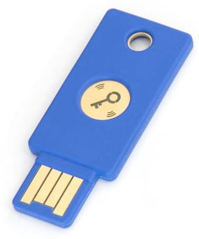

# Security USB Key with Tock

This module and submodules will walk you through how to create a USB security
key using Tock.

## Hardware Notes

To fully follow this guide you will need a hardware board that supports a
peripheral USB port (i.e. where the microcontroller has USB hardware support).
We recommend using the nRF52840dk.

Compatible boards:

- nRF52840dk
- imix

You'll also need two USB cables, one for programming the board and the other for
attaching it as a USB device.

## Goal

Our goal is to create a standards-compliant HOTP USB key that we can use with a
demo website. The key will support enrolling new URL domains and providing
secure authentication.

The main logic of the key will be implemented as a userspace program. That
userspace app will use the kernel to decrypt the shared key for each domain,
send the HMAC output as a USB keyboard device, and store each encrypted key in a
nonvolatile key-value storage.

## nRF52840dk Hardware Setup

If you are using the nRF52840dk, there are a couple of configurations on the
nRF52840DK board that you should double-check:

1. The "Power" switch on the top left should be set to "On".
2. The "nRF power source" switch in the top middle of the board should be set to
   "VDD".
3. The "nRF ONLY | DEFAULT" switch on the bottom right should be set to
   "DEFAULT".

For now, you should plug one USB cable into the top of the board for programming
(NOT into the "nRF USB" port on the side). We'll attach the other USB cable
later.

## Stages

This module is broken into three stages:

1. [Creating an HOTP userspace application](./key-hotp-application.md).
2. [Creating an in-kernel encryption oracle](./key-hotp-oracle.md).
3. [Enforcing access control restrictions to the oracle](./key-hotp-access.md).
