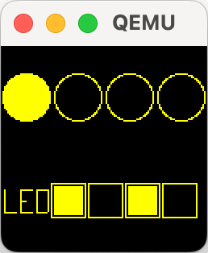
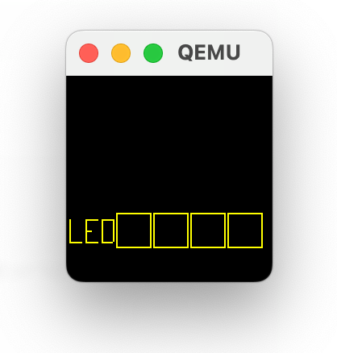
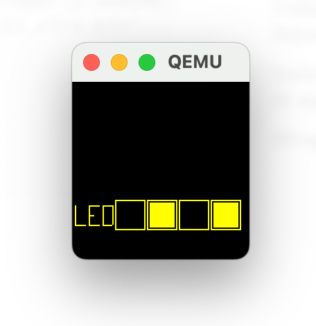
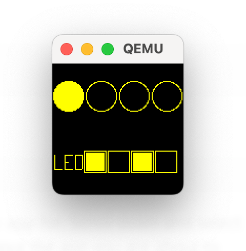

# QEMU + libtock-rs



This mini tutorial will get you started running Tock on
[QEMU](https://www.qemu.org/docs/master/about/index.html). QEMU emulates a
RISC-V board and runs the Tock kernel and apps. This tutorial does not require
any physical hardware board and can run on any platform. By the end of this
tutorial you will be able to run multiple libtock-rs apps in QEMU.

## Setup

You will need the standard Tock setup for this tutorial, plus QEMU. You do not
need JlinkExe or OpenOCD (as noted in the getting started guide), since we are
not programming hardware.

The basic steps for each platform are included here.

### macOS

1. Install [rustup](https://rustup.rs/#).
   ```
   curl --proto '=https' --tlsv1.2 -sSf https://sh.rustup.rs | sh
   ```
2. Clone the Tock repository and libtock-rs.
   ```
   git clone https://github.com/tock/tock
   git clone https://github.com/tock/libtock-rs
   ```
3. Install [tockloader](https://github.com/tock/tockloader/) version 1.15.0+.
   ```
   brew install pipx
   pipx install tockloader
   pipx ensurepath
   ```
4. Install [QEMU](https://www.qemu.org/download/).
   ```
   brew install qemu
   ```

### Ubuntu

As of September 2025, running this tutorial on Ubuntu can be difficult because
it requires a relatively recent version of QEMU (i.e., >9.0). If you are on
Ubuntu 24.10 or newer it should work. Otherwise, it can be hard to get a new
enough version of QEMU.

1. Install [rustup](https://rustup.rs/#).
   ```
   curl --proto '=https' --tlsv1.2 -sSf https://sh.rustup.rs | sh
   ```
2. Clone the Tock repository and libtock-rs.
   ```
   git clone https://github.com/tock/tock
   git clone https://github.com/tock/libtock-rs
   ```
3. Install [tockloader](https://github.com/tock/tockloader/).
   ```
   sudo apt install pipx
   pipx install tockloader
   pipx ensurepath
   ```
4. Install [QEMU](https://www.qemu.org/download/).
   ```
   sudo apt install qemu-system
   ```

### Windows

The best way to install Tock from Windows is to setup the Windows Subsystem for
Linux (WSL), compile Tock and applications in WSL, and then run QEMU from normal
Windows.

The reason it is easier to build Tock from WSL is that building the kernel and
apps uses Makefiles, and those are not well supported in normal Windows. The
reason it is easier to run QEMU from normal Windows is that we need a new
version of QEMU and the Windows installers make it easy to install a new
version.

1. Setup Windows Subsystem for Linux (WSL) if you haven't already.
   [WSL instructions](https://learn.microsoft.com/en-us/windows/wsl/install).
   You can choose your linux distro, but the latest version of Ubuntu is a good
   choice if you don't have a preference.

   To open a WSL shell, search "ubuntu" in the start menu, or
   [use a method here](https://learn.microsoft.com/en-us/windows/wsl/install#ways-to-run-multiple-linux-distributions-with-wsl).

2. From WSL, install [rustup](https://rustup.rs/#).
   ```
   curl --proto '=https' --tlsv1.2 -sSf https://sh.rustup.rs | sh
   ```
3. From WSL, clone the Tock repository and libtock-rs.
   ```
   git clone https://github.com/tock/tock
   git clone https://github.com/tock/libtock-rs
   ```
4. From WSL, install [tockloader](https://github.com/tock/tockloader/).
   ```
   sudo apt install pipx
   pipx install tockloader
   pipx ensurepath
   ```
5. Install QEMU using the latest
   [Windows installer](https://qemu.weilnetz.de/w64/).
6. Setup variables in PowerShell to make running QEMU easier. We need two paths,
   the path to the QEMU executable and the path to the board's binary image.

   In PowerShell, assign two variables. Substitute your username and WSL distro
   as needed. You may need to modify these if you used different folders.

   ```
   $qemu = "C:\Program Files\qemu\qemu-system-riscv32.exe"
   $bin  = "\\wsl.localhost\Ubuntu-22.04\home\<username>\tock\boards\tutorials\qemu_rv32_virt-tutorial\qemu_rv32_virt_tutorial.bin"
   ```

## How We Install Tock when using QEMU to Emulate Hardware

The method we use to run Tock on QEMU is different from other systems because
Tock supports multiple applications, and we want to be able to install
applications independently. To support this, tockloader does not somehow write
to the QEMU emulator directly. Instead, it writes to a binary file stored on
your machine as though that was the flash storage of the QEMU target.

When we are ready to run the board by starting QEMU, that local binary file is
given to the board as its flash contents, which contains the Tock kernel and all
installed applications.

## Running Just the Kernel

To start, let's run QEMU with just the kernel installed (i.e., no apps).
Navigate to the board configuration for this tutorial and build the kernel:

```
cd tock/boards/tutorials/qemu_rv32_virt-tutorial
make init
make
make install
```

This should build the kernel.

> Note: on the first build rustup will need to install the correct toolchain, so
> the build will take longer than normal.

Now we can run QEMU with that kernel.

On macOS or Linux:

```
make run
```

On Windows, open a PowerShell and run:

```
& $qemu -machine virt -semihosting -global driver=riscv-cpu,property=smepmp,value=true -global virtio-mmio.force-legacy=false -device virtio-rng-device -device virtio-keyboard-device -device virtio-gpu-device  -serial stdio -bios $bin
```

You should see a window popup which is our virtual screen. It should look
roughly like this, but will vary depending on your system.



The serial output from the kernel will be displayed in the terminal. You should
see something like:

```
Running QEMU emulator version 10.0.3 (tested: 8.2.7, 9.1.3, 9.2.3, 10.0.2; known broken: <= 8.1.5) with
  - kernel /Users/bradjc/git/tock/target/riscv32imac-unknown-none-elf/release/qemu_rv32_virt.elf
To exit type C-a x

qemu-system-riscv32 -machine virt -semihosting -global driver=riscv-cpu,property=smepmp,value=true -global virtio-mmio.force-legacy=false -device virtio-rng-device -device virtio-keyboard-device -device virtio-gpu-device  -serial stdio \
	  -bios '/Users/bradjc/Library/Application Support/tockloader/qemu_rv32_virt.bin'
QEMU RISC-V 32-bit "virt" machine, initialization complete.
- Found VirtIO GPUDevice, enabling video output
- Found VirtIO EntropySource device, enabling RngDriver
- VirtIO NetworkCard device not found, disabling EthernetTapDriver
- Found VirtIO Input device, enabling Input
Starting main kernel loop.
```

### What is on the screen?

Many tock apps expect a 128x64 pixel screen. We use the top half of the screen
window for apps that want to draw to the screen. In the bottom half (where "LED"
is), we emulate peripherals that we do not actually have (e.g., we don't have
physical LEDs) by drawing them on the screen.

## Installing a simple `libtock-rs` app

To start, let's install the blink app written in Rust. To do this, we first need
to compile the `blink` example.

```
cd libtock-rs
make tab EXAMPLE=blink
```

Then install it using `tockloader`. You may need to select it from a list.
Scroll to the blink.tab app and press spacebar to select it. Then hit enter.

```
tockloader install
```

Because we are using a local binary file to store apps, installing the app only
writes it to a local file. We can use tockloader to view that blink was
installed.

```
tockloader list
```

Example output:

```
[INFO   ] No device name specified. Using default name "tock".
[INFO   ] Using flash-file to communicate with the board.
[INFO   ] Using settings from KNOWN_BOARDS["qemu_rv32_virt"]
[INFO   ] Operating on flash file "/Users/bradjc/git/tock/boards/tutorials/qemu_rv32_virt-tutorial/qemu_rv32_virt_tutorial.bin".
[INFO   ] Limiting flash size to 0x200000 bytes.
┌──────────────────────────────────────────────────┐
│ App 0                                            |
└──────────────────────────────────────────────────┘
  Name:                  blink
  Version:               0
  Enabled:               True
  Sticky:                False
  Total Size in Flash:   1472 bytes


[INFO   ] Finished in 0.001 seconds
```

To actually run the installed app we must run the board which starts qemu.

```
# macOS and Linux:
cd tock/boards/tutorials/qemu_rv32_virt-tutorial
make run

# Windows, from PowerShell:
& $qemu -machine virt -semihosting -global driver=riscv-cpu,property=smepmp,value=true -global virtio-mmio.force-legacy=false -device virtio-rng-device -device virtio-keyboard-device -device virtio-gpu-device  -serial stdio -bios $bin
```

In the QEMU screen you should now see the virtual LEDs blinking.



## Install a second libtock-rs app

Now that we can see the (virtual) LEDs blink, let's try a second application.
This userspace app will draw virtual buttons on the screen, and will respond to
"button" presses.

First, let's build the app. To do this, we will build a demo app in libtock-rs:

```
cd libtock-rs/demos/embedded_graphics/buttons
make
```

You will see the app get built several times. This is because we need to link
the app for many possible flash/RAM addresses for different platforms that Tock
supports. Eventually the build process will complete and generate a `.tab` file
we can install.

```
$ ls target/tab
buttons.tab
```

We can inspect that tab with tockloader:

```
tockloader inspect-tab
```

You can see the various architectures and addresses we compile the app for.
Scroll down and select `rv32imac.0x80100000.0x80300000`. This will display some
details about the app you are about to install:

```
TAB: buttons
  build-date: 2025-08-25 20:54:22+00:00
  minimum-tock-kernel-version: 2.1
  tab-version: 1
  included architectures: cortex-m0, cortex-m33, cortex-m4, rv32imac, rv32imc

 Which TBF to inspect further? rv32imac.0x80100000.0x80300000

rv32imac.0x80100000.0x80300000:
  TBF version           : 2                       [0x0  ]
  header_size           :         88         0x58
  total_size            :      13204       0x3394
  checksum              :              0x746d1a8a
  flags                 :          1          0x1
    enabled             : Yes
    sticky              : No
  TLV: Main (1)                                   [0x10 ]
    init_fn_offset      :         72         0x48
    protected_size      :         40         0x28
    minimum_ram_size    :       7072       0x1ba0
  TLV: Program (9)                                [0x20 ]
    init_fn_offset      :         72         0x48
    protected_size      :         40         0x28
    minimum_ram_size    :       7072       0x1ba0
    binary_end_offset   :      12948       0x3294
    app_version         :          0          0x0
  TLV: Package Name (3)                           [0x38 ]
    package_name        : buttons
  TLV: Fixed Addresses (5)                        [0x44 ]
    fixed_address_ram   : 2150629376   0x80300000
    fixed_address_flash : 2148532352   0x80100080
  TLV: Kernel Version (8)                         [0x50 ]
    kernel_major        : 2
    kernel_minor        : 1
    kernel version      : ^2.1

TBF Footers
  Footer
    footer_size         :        256        0x100
  Footer TLV: Credentials (128)                   [0x0  ]
    Type: Reserved (0)
    Length: 248
```

Now to install, we can run `make install`:

```
tockloader install
```

Remember, this has only installed the app to our local binary file which
represents the QEMU system flash. You should see an app layout that looks like
this with both of our apps:

```
[INFO   ] Found sort order:
[INFO   ]   App "blink" at Flash=0x80100080
[INFO   ]   App "buttons" at Flash=0x80110080
[INFO   ] App Layout:
[INFO   ] 0x80100000┬──────────────────────────────────────────────────┐
[INFO   ]           │App: blink                             [Installed]│
[INFO   ]           │  Length: 1472 (0x5c0)                            │
[INFO   ] 0x801005c0┼──────────────────────────────────────────────────┤
[INFO   ]           │Padding                                           │
[INFO   ]           │  Length: 64064 (0xfa40)                          │
[INFO   ] 0x80110000┼──────────────────────────────────────────────────┤
[INFO   ]           │App: buttons                            [From TAB]│
[INFO   ]           │  Length: 13204 (0x3394)                          │
[INFO   ] 0x80113394┴──────────────────────────────────────────────────┘
```

To run the apps, go back to the board folder in the kernel and enter `make run`:

```
# macOS and Linux:
cd tock/boards/tutorials/qemu_rv32_virt-tutorial
make run

# Windows, from PowerShell:
& $qemu -machine virt -semihosting -global driver=riscv-cpu,property=smepmp,value=true -global virtio-mmio.force-legacy=false -device virtio-rng-device -device virtio-keyboard-device -device virtio-gpu-device  -serial stdio -bios $bin
```

You should see the QEMU window appear and the virtual LEDs are blinking.



You can use the keyboard with the window selected to simulate button presses.
Once you have selected the QEMU window, you can retrieve your mouse by pressing:

- macOS: `control + option + g`
- Windows: `Ctrl + Alt + g`

With the window selected, you can press the buttons with the up, down, enter,
and backspace buttons:

| Keyboard Key | Button Index |
| ------------ | ------------ |
| Up           | 0            |
| Down         | 2            |
| Enter        | 3            |
| Backspace    | 1            |

## Wrap-up

Congratulations! You have run the Tock kernel with multiple libtock-rs apps!

You can explore further by modifying the `embedded_graphics/buttons` app to use
the
[embedded graphics](https://docs.rs/embedded-graphics/latest/embedded_graphics/)
crate. Only one app can use the screen, but you can uninstall apps using
`tockloader uninstall`.
