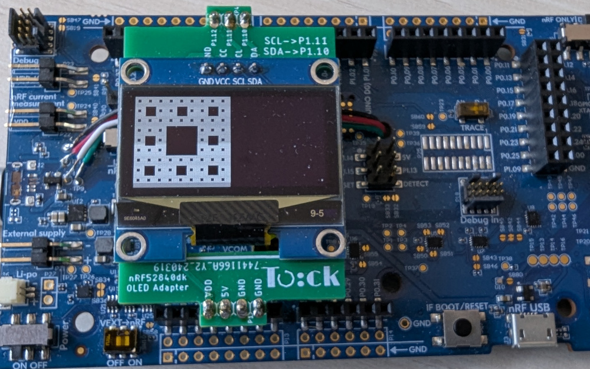

# Screen + U8G2



This mini tutorial will go through the steps to run a simple app to draw
graphics on an attached screen. The graphics library is
[U8G2](https://github.com/olikraus/u8g2), a monochrome graphics stack designed
for embedded devices. The graphics library is included as a libtock-c app.

## Setup

You need a hardware board that can run Tock and a supported screen attached to
the board.

### Recommended Hardware

We recommend using the Nordic nRF52840dk with an SSD1306 screen.

## Installing Tock

The Tock kernel installed on your board must support the `screen` syscall.

### Option 1: Use a pre-configured kernel

The easiest way to get started is to use a Tock kernel that already has the
screen support. With the nRF52840dk and a SSD1306 screen, the kernel located
here:

```
tock/boards/tutorials/nrf52840dk-thread-tutorial
```

is a good option to use as it already has the screen driver installed.

```
cd tock/boards/tutorials/nrf52840dk-thread-tutorial
make install
```

### Option 2: Configure the kernel with the screen driver

If there is not an existing kernel setup you can use, follow the
[directions here](../course/setup/screen.md) on how to include the screen for
your board and kernel.

## Testing the Screen

Use an existing `u8g2`-based userspace application to test the board.

From the `libtock-c` repository:

```
cd libtock-c/examples/tests/u8g2-demos/circle
make
tockloader install --erase
```

You should see a shrinking and growing circle:


### Trying other demonstration apps

Look through the examples in `libtock-c/examples/tests/u8g2-demos` and try some
of them out. Be sure to uninstall previous u8g2 screen apps when installing a
new one, or remove all other apps when installing using the `--erase` flag with
tockloader.

## Write your own U8G2 app

You can use the
[U8G2 documentation](https://github.com/olikraus/u8g2/wiki/u8g2reference) to
write your own U8G2 app with Tock.

Tock uses the U8G2 library directly, so all provided functionality should be
available. You just need to initialize the library in Tock with this basic
boilerplate code:

```c
#include <u8g2-tock.h>
#include <u8g2.h>

u8g2_t u8g2;

int main(void) {
  u8g2_tock_init(&u8g2);

  // U8G2 code goes here
}
```

For example, the spin app looks like this:

```c
#include <math.h>
#include <stdio.h>
#include <stdlib.h>

#include <u8g2-tock.h>
#include <u8g2.h>

#include <libtock-sync/services/alarm.h>

u8g2_t u8g2;

#define PI 3.14

int main(void) {
  u8g2_tock_init(&u8g2);

  int width  = u8g2_GetDisplayWidth(&u8g2);
  int height = u8g2_GetDisplayHeight(&u8g2);

  int center_x = width / 2;
  int center_y = height / 2;
  int radius   = 0;

  if (width < height) {
    radius = center_x - 1;
  } else {
    radius = center_y - 1;
  }

  int rot = 0;

  while (1) {
    u8g2_ClearBuffer(&u8g2);

    double angle = (((double) rot) / 100.0) * (2 * PI);

    int x = center_x + (radius * cos(angle));
    int y = center_y + (radius * sin(angle));

    u8g2_DrawLine(&u8g2, center_x, center_y, x, y);

    u8g2_SendBuffer(&u8g2);
    libtocksync_alarm_delay_ms(200);

    rot = (rot + 1) % 100;
  }
}
```

Happy hacking!
